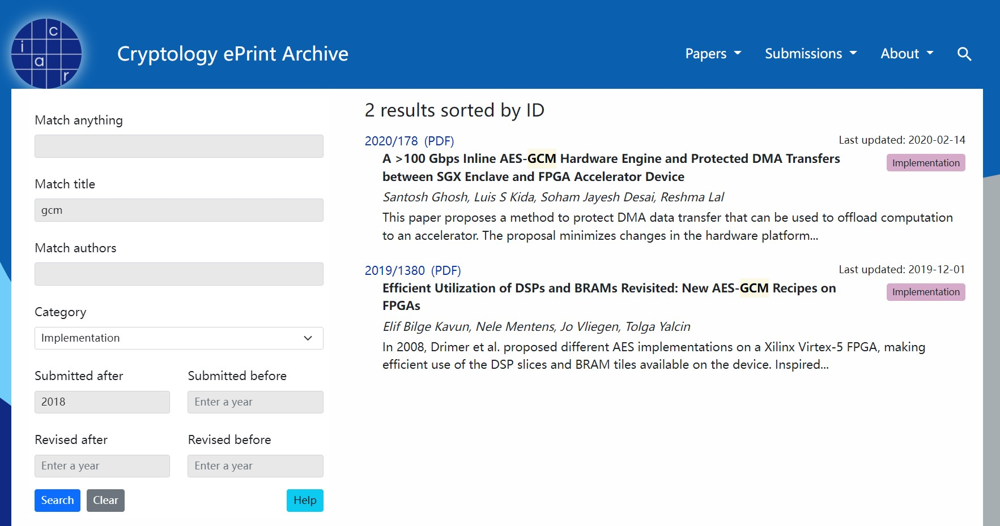

# ePrint论文下载脚本

一个简易的EPRINT([Cryptology ePrint Archive](https://eprint.iacr.org/))论文批量下载脚本，支持关键字等索引方式。主要原理是通过爬取其 `search` 页面 (https://eprint.iacr.org/search) 获取相应的论文信息，支持的索引参数与 `search` 页面中的索引选项一致



## 一、快速开始

项目仅包含3个py文件，`ePrint.py` 为主要的逻辑函数，完成ePrint的爬取与下载。`demo.py` 为一调用样例，具体在下方的1.1处。`ePrintScrapy.py` 为终端版本的简易包装，可以通过配合 `args` 参数的方式进行简单的调用

### 1.1 脚本Demo

```python
import ePrint
from ePrint import ePrint_payload, ePrint_download

# 下载标题包含"gcm"，类别为"IMPLEMENTATION"且提交日期在2018年之后的论文至当前目录./
ePrint_download('./', ePrint_payload(title='gcm',
                                     category=ePrint.CATEGORY_IMPLEMENTATION,
                                     submittedafter='2018'))
```

运行上述demo后控制台将会提示下载信息，格式为 `[ePrint Download]: <论文名称>, <论文链接>`
且在运行目录应当能看到下载完成的论文

```
================================================================
[ePrint fetch papers]: 2 results
[ePrint Download]: Efficient Utilization of DSPs and BRAMs Revisited: New AES-GCM Recipes on FPGAs, https://eprint.iacr.org/2019/1380.pdf
[ePrint Download]: A >100 Gbps Inline AES-GCM Hardware Engine and Protected DMA Transfers between SGX Enclave and FPGA Accelerator Device, https://eprint.iacr.org/2020/178.pdf
```

### 1.2 ePrint.py 接口

其主要的函数为 `ePrint_download` 和 `ePrint_payload`，前者执行下载操作，后者用于构造查询的 payload

`ePrint_payload` 函数如下，其每个可选参数与 ePrint Archive 中的索引参数一致

```python
def ePrint_payload(q='', title='', authors='', category='',
                   submittedafter='',
                   submittedbefore='',
                   revisedafter='',
                   revisedbefore='') -> dict:
    """
    :param q:               Match anything
    :param title:           Match title
    :param authors:         Match title
    :param category:        Category
    :param submittedafter:  Submitted after
    :param submittedbefore: Submitted before
    :param revisedafter:    Revised after
    :param revisedbefore:   Revised before
    :return: payload Dict
    """
    pass
```

`ePrint_download` 函数如下，在下载时可选择开启多线程的方式，默认开启6个线程。由于 ePrint Archive 的页面每页最多显示 100 条论文数据，下载时也是以 100 篇论文为单位分批次下载，故需要根据实际情况合理设置线程数

```python
def ePrint_download(target_dir: str, payload: dict, j: int = 6) -> None:
    """
    :param target_dir:  目标目录
    :param payload:     ePrint 检索payload
    :param j:           线程数
    """
    pass
```

除了上述两个函数，`ePrint.py` 中还定义了 CATEGORY 对应的常量数据，而空字符串对应 `ALL_CATEGORY`

```python
CATEGORY_APPLICATIONS = 'APPLICATIONS'
CATEGORY_PROTOCOLS = 'PROTOCOLS'
CATEGORY_FOUNDATIONS = 'FOUNDATIONS'
CATEGORY_IMPLEMENTATION = 'IMPLEMENTATION'
CATEGORY_SECRETKEY = 'SECRETKEY'
CATEGORY_PUBLICKEY = 'PUBLICKEY'
CATEGORY_ATTACKS = 'ATTACKS'
```

### 1.3 终端App

`ePrintScrapy.py` 是对 `ePrint.py` 的简要包装，用于从控制台简易地调用脚本，在终端中输入下述命令

```
python ePrintScrapy.py -h
```

可得到命令参数的详细信息，其每个参数与 `ePrint_download` 函数一一对应

```
usage: ePrintScrapy.py [-h] [-j JOBS] [-p PAYLOAD] output_dir

positional arguments:
  target_dir            target dir

options:
  -h, --help            show this help message and exit
  -j JOBS, --jobs JOBS  parallel jobs, default=6
  -p PAYLOAD, --payload PAYLOAD
                        payload json file, default=payload.json
```

需要注意的是，若使用该方式运行脚本，则需要准备响应的 `json` 文件作为索引，一个简易的 `json` 模板为

```json
{
  "q": "",
  "title": "",
  "authors": "",
  "category": "",
  "submittedafter": "",
  "submittedbefore": "",
  "revisedafter": "",
  "revisedbefore": ""
}
```

若是需要运行与 `demo.py` 一致的效果，则 `json` 文件应写成如下形式，其中的 `category` 需要与 `ePrint.py` 中对应的 `category` 常量一致。此处新建一个文件 `demo.json` 并填入下述内容

```json
{
  "q": "",
  "title": "gcm",
  "authors": "",
  "category": "IMPLEMENTATION",
  "submittedafter": "2018",
  "submittedbefore": "",
  "revisedafter": "",
  "revisedbefore": ""
}
```

随后在终端执行

```bash
python ePrintScrapy.py -p demo.json ./
```

将达到与 `demo.py` 一致的效果
